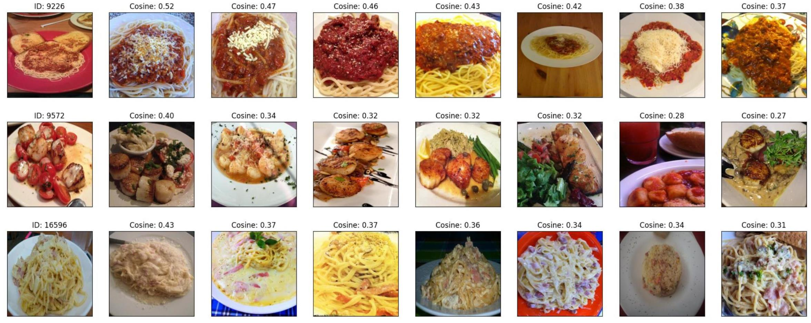
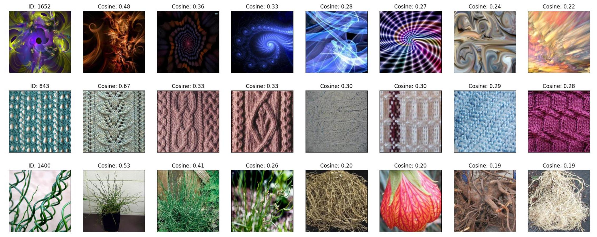

# UNICOM  


[[paper]](https://arxiv.org/abs/2304.05884) [[gdrive]](https://drive.google.com/drive/folders/18wsNgZeNpjKAcIrWoffJ8o9UqmMHUBqN?usp=share_link)

[](https://paperswithcode.com/sota/metric-learning-on-in-shop-1?p=unicom-universal-and-compact-representation)  
[](https://paperswithcode.com/sota/image-retrieval-on-sop?p=unicom-universal-and-compact-representation)  
[](https://paperswithcode.com/sota/image-retrieval-on-inaturalist?p=unicom-universal-and-compact-representation)  
[](https://paperswithcode.com/sota/self-supervised-image-classification-on?p=unicom-universal-and-compact-representation)  
[](https://paperswithcode.com/sota/image-classification-on-imagenet?p=unicom-universal-and-compact-representation)


For image representation:
1. ImageNet pretraining is not universal enough to generalize to diverse open-world objects.
2. Supervised learning is not scalable because manual annotation of large-scale training data is time-consuming, costly, and even infeasible.
3. Instance discrimination method (e.g., CLIP) can hardly encode the semantic structure of training data, because instance-wise contrastive learning always treats two samples as a negative pair, regardless of their semantic similarity.

UNICOM demonstrates superior performance in image retrieval, thanks to its ability to cluster **400000000** images into **1000000** pseudo classes using joint textual and visual features extracted by the CLIP model. Additionally, our use of a margin-based softmax loss (ArcFace) and random partial class/feature (PartialFC) selections enhances the robustness and compactness of the feature embedding. Our method outperforms state-of-the-art unsupervised and supervised image retrieval approaches, making it a powerful tool for researchers and practitioners in the field.

The model unicom was pre-trained on [laion400M](https://laion.ai/blog/laion-400-open-dataset/), and in the future, we will release the model trained on laion2B.


## Usage
First, install PyTorch 1.12 (or later) and torchvision, as well as small additional dependencies, and then install this repo as a Python package.
On a CUDA GPU machine, the following will do the trick:

```shell
pip install torch torchvision
pip install tqdm timm
pip install git+https://github.com/deepglint/unicom.git
```

### API

The unicom module provides the following methods:

#### `unicom.available_models()`

Returns the names of the available unicom models.

#### `unicom.load(name)`

Returns the model and the TorchVision transform needed by the model, specified by the model name returned by `unicom.available_models()`. It will download the model as necessary.

## Results and Evaluation

### Result Transfer-Learning on ImageNet1K

| Dataset    | ViT-B/32@384px | ViT-B/16@384px | ViT-L/14@518px |
| ---------- | -------------- | -------------- | -------------- |
| ImageNet1k | 83.6           | 85.9           | 88.3           |

### Result KNN on ImageNet1K
| Dataset    | ViT-B/32 | ViT-B/16 | ViT-L/14 | ViT-L/14@336px |
| ---------- | -------- | -------- | -------- | -------------- |
| ImageNet1K | 74.5     | 78.8     | 81.2     | 81.6           |


### Result of Supervised Image Retrieval

| Dataset     | ViT-B/32 | ViT-B/16 | ViT-L/14 | ViT-L/14@336px |
| ----------- | -------- | -------- | -------- | -------------- |
| SOP         | 87.1     | 88.8     | 89.9     | 91.2           |
| In-Shop     | 94.8     | 95.5     | 96.0     | 96.7           |
| INaturalist | 72.8     | 82.5     | 85.4     | 88.9           |

### Result of Zero-Shot Image Retrieval

| Dataset     | ViT-B/32 | ViT-B/16 | ViT-L/14 | ViT-L/14@336px |
| ----------- | -------- | -------- | -------- | -------------- |
| CUB         | 83.7     | 86.5     | 88.5     | 89.2           |
| Cars        | 95.9     | 96.8     | 96.9     | 97.3           |
| SOP         | 70.0     | 70.4     | 72.7     | 74.5           |
| In-Shop     | 72.8     | 74.6     | 83.6     | 86.7           |
| INaturalist | 64.6     | 73.6     | 77.1     | 81.0           |


### Eval Image Retrieval
Zero-Shot CUB Dataset with a Single GPU.  

```shell
torchrun retrieval.py --eval --dataset cub --model_name ViT-B/32
```

Zero-Shot CUB Dataset with 8 GPUs.

```shell
torchrun --nproc_per_node 8 retrieval.py --eval --dataset cub --model_name ViT-B/32
```

### Eval KNN
```shell  

torchrun --nproc_per_node 8 knn.py --train-dataset /imagenet/train/ --val-dataset /imagenet/val/ --num-workers 4 --model-name ViT-B/32
```  

## Vis ZeroShot Retrieval

#### 1. **Food-101**

#### 2. **Describable Textures Dataset**


## Citation

```latex
@inproceedings{anxiang_2023_unicom,
  title={Unicom: Universal and Compact Representation Learning for Image Retrieval},
  author={An, Xiang and Deng, Jiankang and Yang, Kaicheng and Li, Jiawei and Feng, Ziyong and Guo, Jia and Yang, Jing and Liu, Tongliang},
  booktitle={ICLR},
  year={2023}
}
@inproceedings{deng2019arcface,
  title={Arcface: Additive angular margin loss for deep face recognition},
  author={Deng, Jiankang and Guo, Jia and Xue, Niannan and Zafeiriou, Stefanos},
  booktitle={CVPR},
  pages={4690--4699},
  year={2019}
}
@inproceedings{anxiang_2022_partialfc,
    author={An, Xiang and Deng, Jiankang and Guo, Jia and Feng, Ziyong and Zhu, XuHan and Yang, Jing and Liu, Tongliang},
    title={Killing Two Birds With One Stone: Efficient and Robust Training of Face Recognition CNNs by Partial FC},
    booktitle={CVPR},
    year={2022},
    pages={4042-4051}
}
```
